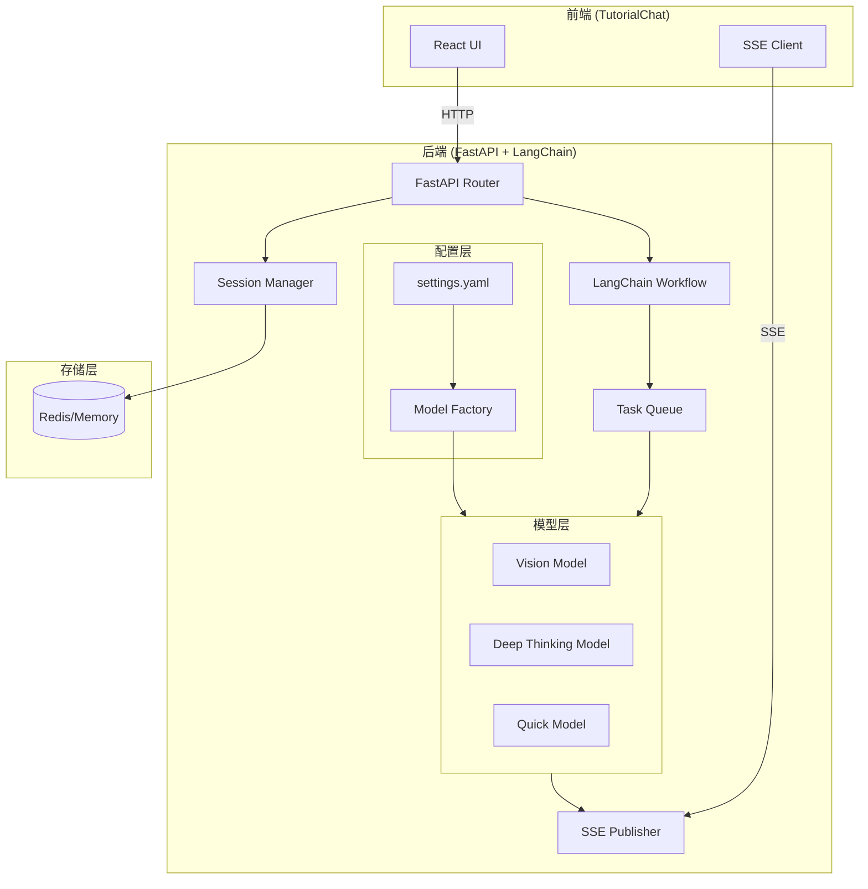
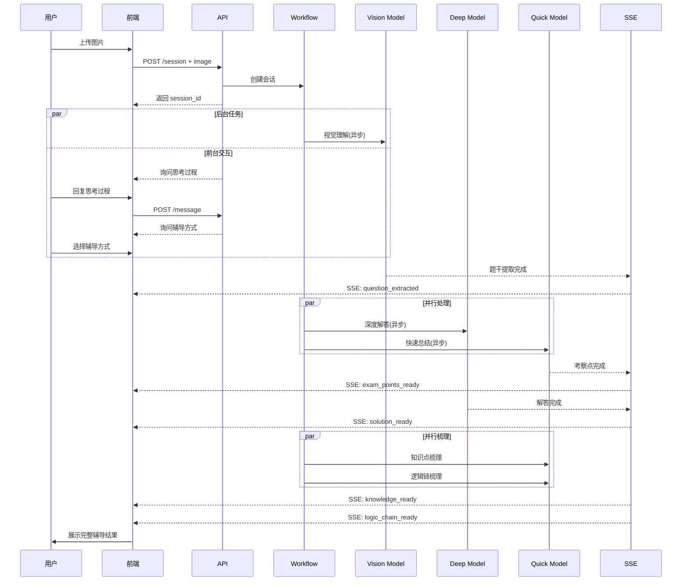

# Design Document

## Overview

Biology_Tutorial Workflow 是一个基于 LangChain 和 FastAPI 构建的后端服务，为高三生物错题辅导提供智能化支持。系统采用异步并行架构，将耗时的视觉理解和深度推理任务放在后台执行，同时通过 SSE 实时推送任务状态，确保前端用户获得流畅的交互体验。

### 核心设计原则

1. **异步优先**: 所有耗时任务异步执行，不阻塞用户交互
2. **实时反馈**: 通过 SSE 推送任务完成通知
3. **可配置性**: 模仿 GraphRAG 风格的 settings.yaml 配置
4. **温柔人设**: 所有 AI 响应采用"温柔大姐姐"风格

## Architecture

### 系统架构图



### 任务流水线架构



## Components and Interfaces

### 1. 配置管理模块 (config/)

```python
# config/settings.py
from pydantic import BaseModel
from typing import Optional
import yaml

class ModelConfig(BaseModel):
    """模型配置"""
    provider: str  # doubao, openai, zhipu, etc.
    model_name: str
    api_key: str
    api_base: Optional[str] = None
    temperature: float = 0.7
    max_tokens: int = 4096

class VisionModelConfig(ModelConfig):
    """视觉模型配置"""
    provider: str = "doubao"
    model_name: str = "doubao-1.6-vision"

class Settings(BaseModel):
    """全局配置"""
    vision_model: VisionModelConfig
    deep_thinking_model: ModelConfig
    quick_model: ModelConfig
    persona_prompt: str
    redis_url: Optional[str] = None
    
    @classmethod
    def from_yaml(cls, path: str = "settings.yaml") -> "Settings":
        with open(path, 'r', encoding='utf-8') as f:
            data = yaml.safe_load(f)
        return cls(**data)
```

### 2. 会话管理模块 (session/)

```python
# session/manager.py
from dataclasses import dataclass, field
from enum import Enum
from typing import Dict, Any, Optional
import asyncio

class TaskStatus(Enum):
    PENDING = "pending"
    RUNNING = "running"
    COMPLETED = "completed"
    FAILED = "failed"

class TutoringStyle(Enum):
    GUIDED = "guided"      # 引导式
    DIRECT = "direct"      # 直接解答

@dataclass
class TaskState:
    status: TaskStatus = TaskStatus.PENDING
    result: Optional[Any] = None
    error: Optional[str] = None

@dataclass
class Session:
    session_id: str
    image_data: Optional[bytes] = None
    user_thinking: Optional[str] = None
    user_confusion: Optional[str] = None
    tutoring_style: Optional[TutoringStyle] = None
    
    # 任务状态
    tasks: Dict[str, TaskState] = field(default_factory=lambda: {
        "vision_extraction": TaskState(),
        "exam_points": TaskState(),
        "deep_solution": TaskState(),
        "knowledge_points": TaskState(),
        "logic_chain": TaskState(),
    })
    
    # 结果存储
    question_text: Optional[str] = None
    exam_points: Optional[str] = None
    solution: Optional[str] = None
    knowledge_points: Optional[list] = None
    logic_chain: Optional[str] = None

class SessionManager:
    """会话管理器"""
    
    async def create_session(self, session_id: str) -> Session: ...
    async def get_session(self, session_id: str) -> Optional[Session]: ...
    async def update_session(self, session_id: str, **kwargs) -> None: ...
    async def update_task_status(self, session_id: str, task_name: str, 
                                  status: TaskStatus, result: Any = None) -> None: ...
```

### 3. LangChain Workflow 模块 (workflow/)

```python
# workflow/chains.py
from langchain_core.runnables import RunnableParallel, RunnableLambda
from langchain_core.prompts import ChatPromptTemplate
from langchain_core.output_parsers import StrOutputParser

class BiologyTutorWorkflow:
    """生物辅导 Workflow"""
    
    def __init__(self, settings: Settings, session_manager: SessionManager, 
                 sse_publisher: SSEPublisher):
        self.settings = settings
        self.session_manager = session_manager
        self.sse = sse_publisher
        self._init_models()
        self._init_chains()
    
    def _init_models(self):
        """初始化各模型"""
        self.vision_model = ModelFactory.create(self.settings.vision_model)
        self.deep_model = ModelFactory.create(self.settings.deep_thinking_model)
        self.quick_model = ModelFactory.create(self.settings.quick_model)
    
    def _init_chains(self):
        """初始化 LangChain chains"""
        # 视觉理解 Chain
        self.vision_chain = self._create_vision_chain()
        # 深度解答 Chain
        self.solution_chain = self._create_solution_chain()
        # 快速总结 Chain
        self.exam_points_chain = self._create_exam_points_chain()
        # 知识点梳理 Chain
        self.knowledge_chain = self._create_knowledge_chain()
        # 逻辑链梳理 Chain
        self.logic_chain = self._create_logic_chain()
    
    async def process_image(self, session_id: str, image_data: bytes):
        """处理图片 - 启动后台任务"""
        # 异步启动视觉理解
        asyncio.create_task(self._run_vision_extraction(session_id, image_data))
    
    async def _run_vision_extraction(self, session_id: str, image_data: bytes):
        """执行视觉理解"""
        await self.session_manager.update_task_status(
            session_id, "vision_extraction", TaskStatus.RUNNING
        )
        try:
            question_text = await self.vision_chain.ainvoke({"image": image_data})
            await self.session_manager.update_session(
                session_id, question_text=question_text
            )
            await self.session_manager.update_task_status(
                session_id, "vision_extraction", TaskStatus.COMPLETED, question_text
            )
            # 通知前端
            await self.sse.publish(session_id, "question_extracted", {
                "question_text": question_text
            })
            # 启动后续并行任务
            await self._start_parallel_analysis(session_id, question_text)
        except Exception as e:
            await self.session_manager.update_task_status(
                session_id, "vision_extraction", TaskStatus.FAILED, error=str(e)
            )
            await self.sse.publish(session_id, "task_failed", {
                "task": "vision_extraction", "error": str(e)
            })
    
    async def _start_parallel_analysis(self, session_id: str, question_text: str):
        """启动并行分析任务"""
        # 使用 RunnableParallel 并行执行
        parallel_chain = RunnableParallel(
            exam_points=self.exam_points_chain,
            solution=self.solution_chain
        )
        
        # 异步执行
        asyncio.create_task(
            self._run_parallel_analysis(session_id, question_text, parallel_chain)
        )
    
    async def _run_parallel_analysis(self, session_id: str, question_text: str, 
                                      parallel_chain):
        """执行并行分析"""
        session = await self.session_manager.get_session(session_id)
        
        # 更新任务状态
        await self.session_manager.update_task_status(
            session_id, "exam_points", TaskStatus.RUNNING
        )
        await self.session_manager.update_task_status(
            session_id, "deep_solution", TaskStatus.RUNNING
        )
        
        # 并行执行
        results = await parallel_chain.ainvoke({
            "question": question_text,
            "user_thinking": session.user_thinking,
            "user_confusion": session.user_confusion
        })
        
        # 处理考察点结果 (快速完成)
        await self._handle_exam_points_result(session_id, results["exam_points"])
        
        # 处理解答结果 (较慢完成)
        await self._handle_solution_result(session_id, results["solution"])
```

### 4. SSE 发布模块 (sse/)

```python
# sse/publisher.py
from typing import Dict, Set, Any
import asyncio
import json

class SSEPublisher:
    """SSE 事件发布器"""
    
    def __init__(self):
        self._subscribers: Dict[str, Set[asyncio.Queue]] = {}
        self._pending_events: Dict[str, list] = {}  # 存储断线期间的事件
    
    async def subscribe(self, session_id: str) -> asyncio.Queue:
        """订阅会话事件"""
        if session_id not in self._subscribers:
            self._subscribers[session_id] = set()
        
        queue = asyncio.Queue()
        self._subscribers[session_id].add(queue)
        
        # 发送断线期间的待处理事件
        if session_id in self._pending_events:
            for event in self._pending_events[session_id]:
                await queue.put(event)
            del self._pending_events[session_id]
        
        return queue
    
    async def unsubscribe(self, session_id: str, queue: asyncio.Queue):
        """取消订阅"""
        if session_id in self._subscribers:
            self._subscribers[session_id].discard(queue)
    
    async def publish(self, session_id: str, event_type: str, data: Any):
        """发布事件"""
        event = {
            "type": event_type,
            "data": data,
            "timestamp": time.time()
        }
        
        if session_id in self._subscribers and self._subscribers[session_id]:
            for queue in self._subscribers[session_id]:
                await queue.put(event)
        else:
            # 存储待处理事件
            if session_id not in self._pending_events:
                self._pending_events[session_id] = []
            self._pending_events[session_id].append(event)
```

### 5. API 路由模块 (api/)

```python
# api/routes.py
from fastapi import APIRouter, UploadFile, File, HTTPException
from fastapi.responses import StreamingResponse
from pydantic import BaseModel

router = APIRouter(prefix="/api")

class CreateSessionResponse(BaseModel):
    session_id: str
    greeting: str

class MessageRequest(BaseModel):
    content: str

class MessageResponse(BaseModel):
    content: str
    task_updates: list = []

@router.post("/session", response_model=CreateSessionResponse)
async def create_session():
    """创建新的辅导会话"""
    session_id = str(uuid.uuid4())
    await session_manager.create_session(session_id)
    
    greeting = await generate_greeting()  # 温柔大姐姐风格问候
    return CreateSessionResponse(
        session_id=session_id,
        greeting=greeting
    )

@router.post("/session/{session_id}/image")
async def upload_image(session_id: str, file: UploadFile = File(...)):
    """上传错题图片"""
    session = await session_manager.get_session(session_id)
    if not session:
        raise HTTPException(404, "Session not found")
    
    image_data = await file.read()
    await session_manager.update_session(session_id, image_data=image_data)
    
    # 启动后台视觉理解任务
    await workflow.process_image(session_id, image_data)
    
    return {"status": "processing", "message": "图片已收到，正在分析中~"}

@router.post("/session/{session_id}/message", response_model=MessageResponse)
async def send_message(session_id: str, request: MessageRequest):
    """发送消息"""
    session = await session_manager.get_session(session_id)
    if not session:
        raise HTTPException(404, "Session not found")
    
    response = await workflow.process_message(session_id, request.content)
    return MessageResponse(content=response)

@router.get("/session/{session_id}/events")
async def subscribe_events(session_id: str):
    """SSE 事件订阅"""
    async def event_generator():
        queue = await sse_publisher.subscribe(session_id)
        try:
            while True:
                event = await queue.get()
                yield f"data: {json.dumps(event)}\n\n"
        except asyncio.CancelledError:
            await sse_publisher.unsubscribe(session_id, queue)
    
    return StreamingResponse(
        event_generator(),
        media_type="text/event-stream"
    )

@router.get("/session/{session_id}/status")
async def get_status(session_id: str):
    """获取会话状态"""
    session = await session_manager.get_session(session_id)
    if not session:
        raise HTTPException(404, "Session not found")
    
    return {
        "session_id": session_id,
        "tasks": {name: state.status.value for name, state in session.tasks.items()},
        "has_question": session.question_text is not None,
        "has_solution": session.solution is not None
    }
```

## Data Models

### 配置文件格式 (settings.yaml)

```yaml
# settings.yaml - 模仿 GraphRAG 风格

# 视觉理解模型配置
vision_model:
  provider: doubao
  model_name: doubao-1.6-vision
  api_key: ${DOUBAO_API_KEY}
  api_base: https://ark.cn-beijing.volces.com/api/v3
  temperature: 0.3
  max_tokens: 2048

# 深度思考模型配置
deep_thinking_model:
  provider: doubao
  model_name: doubao-pro-32k
  api_key: ${DOUBAO_API_KEY}
  api_base: https://ark.cn-beijing.volces.com/api/v3
  temperature: 0.7
  max_tokens: 8192

# 快速响应模型配置
quick_model:
  provider: doubao
  model_name: doubao-lite-4k
  api_key: ${DOUBAO_API_KEY}
  api_base: https://ark.cn-beijing.volces.com/api/v3
  temperature: 0.5
  max_tokens: 1024

# 人设提示词
persona_prompt: |
  你是一位温柔的大姐姐，擅长辅导高三学生的生物学习。
  你的特点是：
  - 说话温柔有耐心，经常用"呢"、"哦"、"呀"等语气词
  - 善于鼓励学生，即使学生答错也会先肯定他们的思考
  - 解释问题时会用生动的比喻和例子
  - 会关心学生的学习状态和情绪

# Redis 配置 (可选，用于持久化会话)
redis_url: redis://localhost:6379/0
```

### SSE 事件类型

```typescript
// 前端 TypeScript 类型定义
interface SSEEvent {
  type: SSEEventType;
  data: any;
  timestamp: number;
}

type SSEEventType = 
  | "question_extracted"    // 题干提取完成
  | "exam_points_ready"     // 考察点总结完成
  | "solution_ready"        // 详细解答完成
  | "knowledge_ready"       // 知识点梳理完成
  | "logic_chain_ready"     // 解题逻辑链完成
  | "task_failed"           // 任务失败
  | "session_complete";     // 会话完成

interface QuestionExtractedEvent {
  type: "question_extracted";
  data: {
    question_text: string;
  };
}

interface ExamPointsReadyEvent {
  type: "exam_points_ready";
  data: {
    exam_points: string[];
  };
}

interface SolutionReadyEvent {
  type: "solution_ready";
  data: {
    solution: string;
    formatted_for_style: "guided" | "direct";
  };
}
```

### API 请求/响应模型

```python
# models/api.py
from pydantic import BaseModel
from typing import Optional, List
from enum import Enum

class TutoringStyle(str, Enum):
    GUIDED = "guided"
    DIRECT = "direct"

class CreateSessionRequest(BaseModel):
    pass  # 无需参数

class CreateSessionResponse(BaseModel):
    session_id: str
    greeting: str

class UploadImageResponse(BaseModel):
    status: str
    message: str

class SendMessageRequest(BaseModel):
    content: str
    tutoring_style: Optional[TutoringStyle] = None

class SendMessageResponse(BaseModel):
    content: str
    is_final: bool = False

class TaskStatusResponse(BaseModel):
    session_id: str
    tasks: dict
    has_question: bool
    has_solution: bool
    exam_points: Optional[List[str]] = None
    knowledge_points: Optional[List[str]] = None
    logic_chain: Optional[str] = None
```


## Correctness Properties

*A property is a characteristic or behavior that should hold true across all valid executions of a system-essentially, a formal statement about what the system should do. Properties serve as the bridge between human-readable specifications and machine-verifiable correctness guarantees.*

Based on the prework analysis, the following correctness properties have been identified. After reflection, redundant properties have been consolidated.

### Property 1: Configuration Round-Trip Consistency
*For any* valid Settings object, serializing it to YAML and then parsing it back SHALL produce an equivalent Settings object.
**Validates: Requirements 1.1, 1.2**

### Property 2: Default Value Application
*For any* partial configuration missing optional fields, the parsed Settings SHALL contain the specified default values for all missing fields.
**Validates: Requirements 1.3**

### Property 3: Malformed Configuration Rejection
*For any* malformed YAML input (invalid syntax, wrong types, missing required fields), the configuration parser SHALL raise a descriptive error without crashing.
**Validates: Requirements 1.4**

### Property 4: Session Creation Idempotence
*For any* image upload request, the system SHALL return a valid session ID immediately, and the session SHALL exist in the session manager with PENDING task states.
**Validates: Requirements 2.1, 2.2**

### Property 5: Vision Extraction Notification
*For any* completed vision extraction task, an SSE event of type "question_extracted" SHALL be published containing the extracted question text, and the text SHALL not contain solution steps.
**Validates: Requirements 2.3, 2.5**

### Property 6: Task Failure Notification
*For any* failed background task, an SSE event of type "task_failed" SHALL be published containing the task name and error details.
**Validates: Requirements 2.4**

### Property 7: Session State Persistence
*For any* user input (thinking process, confusion, tutoring style), after submission the session SHALL contain the stored value retrievable via get_session.
**Validates: Requirements 3.2, 3.4**

### Property 8: Task Chaining - Vision to Analysis
*For any* session where vision extraction completes successfully, both "exam_points" and "deep_solution" tasks SHALL transition to RUNNING status.
**Validates: Requirements 4.1, 5.1**

### Property 9: Task Chaining - Solution to Knowledge
*For any* session where deep solution completes successfully, both "knowledge_points" and "logic_chain" tasks SHALL transition to RUNNING status.
**Validates: Requirements 6.1**

### Property 10: SSE Event Completeness
*For any* completed task (exam_points, deep_solution, knowledge_points, logic_chain), the corresponding SSE event SHALL contain all required data fields as specified in the event schema.
**Validates: Requirements 4.2, 5.2, 6.2, 6.3**

### Property 11: Session Completion State
*For any* session where both knowledge_points and logic_chain tasks complete, the session status SHALL be marked as "complete".
**Validates: Requirements 6.4**

### Property 12: SSE Reconnection Recovery
*For any* SSE connection that disconnects and reconnects, all events published during disconnection SHALL be delivered upon reconnection in chronological order.
**Validates: Requirements 7.3, 7.4**

### Property 13: Tutoring Style Formatting
*For any* solution output, if tutoring_style is "guided" the output SHALL be formatted as step-by-step questions, and if "direct" it SHALL be formatted as complete explanation.
**Validates: Requirements 4.4**

### Property 14: Exam Points Content Validation
*For any* exam points summary output, the content SHALL not contain reasoning steps or solution derivations.
**Validates: Requirements 5.3**

### Property 15: API Status Response Completeness
*For any* GET /status request, the response SHALL contain status for all five tasks (vision_extraction, exam_points, deep_solution, knowledge_points, logic_chain).
**Validates: Requirements 8.5**

### Property 16: Parallel Execution Verification
*For any* workflow execution requiring parallel tasks, the tasks SHALL execute concurrently (not sequentially), verifiable by comparing total execution time to sum of individual task times.
**Validates: Requirements 10.2**

### Property 17: Error Propagation Graceful Handling
*For any* error occurring in a workflow task, the error SHALL be caught, logged, and propagated via SSE without crashing the server or affecting other sessions.
**Validates: Requirements 10.4**

## Error Handling

### Error Categories

| Category | Examples | Handling Strategy |
|----------|----------|-------------------|
| Configuration Errors | Invalid YAML, missing required fields | Fail fast at startup with clear error message |
| API Errors | Invalid session ID, missing image | Return appropriate HTTP status codes (400, 404) |
| Model Errors | API timeout, rate limit, invalid response | Retry with exponential backoff, then notify via SSE |
| Task Errors | Vision extraction failure, parsing error | Mark task as FAILED, notify via SSE, allow retry |
| SSE Errors | Connection drop, queue overflow | Store pending events, deliver on reconnection |

### Error Response Format

```python
class ErrorResponse(BaseModel):
    error_code: str
    message: str
    details: Optional[dict] = None
    retry_after: Optional[int] = None  # seconds

# Example error codes
ERROR_CODES = {
    "SESSION_NOT_FOUND": "The specified session does not exist",
    "IMAGE_REQUIRED": "An image file is required for this operation",
    "VISION_FAILED": "Failed to extract question from image",
    "MODEL_TIMEOUT": "Model response timed out",
    "INVALID_CONFIG": "Configuration file is invalid",
}
```

### Retry Strategy

```python
from tenacity import retry, stop_after_attempt, wait_exponential

@retry(
    stop=stop_after_attempt(3),
    wait=wait_exponential(multiplier=1, min=2, max=10)
)
async def call_model_with_retry(model, prompt):
    """带重试的模型调用"""
    return await model.ainvoke(prompt)
```

## Testing Strategy

### Dual Testing Approach

本项目采用单元测试和属性测试相结合的方式，确保代码正确性。

#### 单元测试 (pytest)

单元测试用于验证特定示例和边界情况：

```python
# tests/test_config.py
import pytest
from config.settings import Settings

def test_load_valid_config():
    """测试加载有效配置"""
    settings = Settings.from_yaml("tests/fixtures/valid_settings.yaml")
    assert settings.vision_model.provider == "doubao"

def test_default_values_applied():
    """测试默认值应用"""
    settings = Settings.from_yaml("tests/fixtures/minimal_settings.yaml")
    assert settings.vision_model.temperature == 0.7  # default

def test_invalid_yaml_raises_error():
    """测试无效YAML抛出错误"""
    with pytest.raises(ValueError) as exc_info:
        Settings.from_yaml("tests/fixtures/invalid_settings.yaml")
    assert "Invalid configuration" in str(exc_info.value)
```

#### 属性测试 (Hypothesis)

属性测试用于验证跨所有输入的通用属性。使用 **Hypothesis** 库进行属性测试。

每个属性测试必须：
1. 配置至少 100 次迭代
2. 使用注释标注对应的正确性属性
3. 引用设计文档中的属性编号

```python
# tests/test_properties.py
from hypothesis import given, strategies as st, settings
from config.settings import Settings, ModelConfig
import yaml

# **Feature: biology-tutorial-workflow, Property 1: Configuration Round-Trip Consistency**
@settings(max_examples=100)
@given(
    provider=st.sampled_from(["doubao", "openai", "zhipu"]),
    model_name=st.text(min_size=1, max_size=50),
    temperature=st.floats(min_value=0.0, max_value=2.0),
)
def test_config_round_trip(provider, model_name, temperature):
    """
    **Validates: Requirements 1.1, 1.2**
    For any valid Settings, serializing to YAML and parsing back produces equivalent object.
    """
    original = ModelConfig(
        provider=provider,
        model_name=model_name,
        api_key="test-key",
        temperature=temperature
    )
    yaml_str = yaml.dump(original.model_dump())
    parsed = ModelConfig(**yaml.safe_load(yaml_str))
    assert parsed == original

# **Feature: biology-tutorial-workflow, Property 4: Session Creation Idempotence**
@settings(max_examples=100)
@given(image_data=st.binary(min_size=100, max_size=10000))
async def test_session_creation_returns_valid_id(image_data):
    """
    **Validates: Requirements 2.1, 2.2**
    For any image upload, system returns valid session ID with PENDING task states.
    """
    response = await client.post("/api/session")
    assert response.status_code == 200
    session_id = response.json()["session_id"]
    assert len(session_id) > 0
    
    session = await session_manager.get_session(session_id)
    assert all(task.status == TaskStatus.PENDING for task in session.tasks.values())

# **Feature: biology-tutorial-workflow, Property 7: Session State Persistence**
@settings(max_examples=100)
@given(
    thinking=st.text(min_size=1, max_size=1000),
    confusion=st.text(min_size=1, max_size=500),
    style=st.sampled_from(["guided", "direct"])
)
async def test_session_state_persistence(thinking, confusion, style):
    """
    **Validates: Requirements 3.2, 3.4**
    For any user input, session contains stored value after submission.
    """
    session_id = await create_test_session()
    
    await session_manager.update_session(
        session_id, 
        user_thinking=thinking,
        user_confusion=confusion,
        tutoring_style=style
    )
    
    session = await session_manager.get_session(session_id)
    assert session.user_thinking == thinking
    assert session.user_confusion == confusion
    assert session.tutoring_style == style

# **Feature: biology-tutorial-workflow, Property 12: SSE Reconnection Recovery**
@settings(max_examples=100)
@given(events=st.lists(st.text(min_size=1), min_size=1, max_size=10))
async def test_sse_reconnection_recovery(events):
    """
    **Validates: Requirements 7.3, 7.4**
    For any disconnection, all missed events are delivered on reconnection in order.
    """
    session_id = "test-session"
    
    # Publish events while disconnected
    for i, event_data in enumerate(events):
        await sse_publisher.publish(session_id, f"event_{i}", {"data": event_data})
    
    # Reconnect and receive
    queue = await sse_publisher.subscribe(session_id)
    received = []
    while not queue.empty():
        received.append(await queue.get())
    
    assert len(received) == len(events)
    # Verify chronological order
    timestamps = [e["timestamp"] for e in received]
    assert timestamps == sorted(timestamps)
```

### 测试目录结构

```
tests/
├── __init__.py
├── conftest.py              # pytest fixtures
├── fixtures/
│   ├── valid_settings.yaml
│   ├── minimal_settings.yaml
│   └── invalid_settings.yaml
├── unit/
│   ├── test_config.py
│   ├── test_session.py
│   ├── test_api.py
│   └── test_sse.py
└── properties/
    ├── test_config_properties.py
    ├── test_session_properties.py
    ├── test_workflow_properties.py
    └── test_sse_properties.py
```

### 测试运行命令

```bash
# 运行所有测试
pytest tests/ -v

# 只运行单元测试
pytest tests/unit/ -v

# 只运行属性测试
pytest tests/properties/ -v

# 运行属性测试并显示统计
pytest tests/properties/ -v --hypothesis-show-statistics
```
