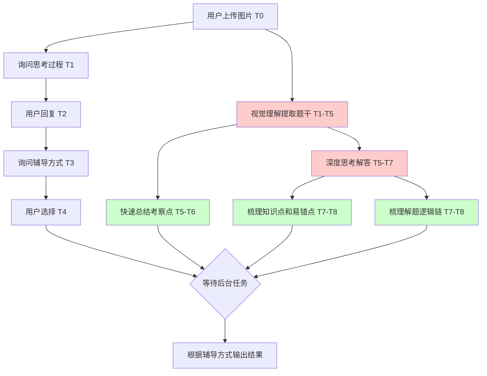

# Requirements Document

## Introduction

Biology_Tutorial 是一个基于 LangChain 的后端 workflow 服务，专为全国甲卷生物高三学生提供错题辅导。系统采用"温柔大姐姐"人设，通过异步并行处理实现实时响应，将耗时的视觉理解和深度推理任务放在后台执行，同时在前台收集用户意图。

## Glossary

- **Workflow**: 基于 LangChain 构建的任务编排流程
- **Vision Model**: 视觉理解模型，用于从图片中提取题干文本（默认使用豆包1.6视觉理解模型）
- **Deep Thinking Model**: 深度思考模型，用于生成详细解答过程
- **Quick Model**: 快速响应模型，用于总结考察点
- **Settings.yaml**: 配置文件，模仿 GraphRAG 风格配置模型参数
- **SSE (Server-Sent Events)**: 服务端推送事件，用于实时通知前端任务完成状态
- **Task Pipeline**: 任务管道，管理异步任务的执行和状态

## 任务执行流程分析

### 时序甘特图

```
时间轴 →
┌─────────────────────────────────────────────────────────────────────────────────────────┐
│ 阶段1: 用户交互 (前台)                                                                    │
├─────────────────────────────────────────────────────────────────────────────────────────┤
│ [T0]────[T1] 用户上传图片                                                                │
│        [T1]────[T2] 询问用户思考过程和疑惑                                                │
│               [T2]────[T3] 用户回复                                                      │
│                      [T3]────[T4] 询问辅导方式(引导式/直接解答)                            │
├─────────────────────────────────────────────────────────────────────────────────────────┤
│ 阶段2: 后台并行任务 (从T1开始)                                                            │
├─────────────────────────────────────────────────────────────────────────────────────────┤
│ [T1]════════════════[T5] 视觉理解提取题干 (耗时任务)                                      │
│                          ↓ 完成通知                                                      │
│                     [T5]════════════════════════[T7] 深度思考解答 (耗时任务)              │
│                     [T5]────[T6] 快速总结考察点                                           │
│                                                      ↓ 完成通知                          │
│                                                 [T7]────[T8] 梳理知识点和易错点           │
│                                                 [T7]────[T8] 梳理解题逻辑链 (并行)        │
├─────────────────────────────────────────────────────────────────────────────────────────┤
│ 阶段3: 结果整合与辅导                                                                     │
├─────────────────────────────────────────────────────────────────────────────────────────┤
│                                                        [T8]──→ 根据用户选择的辅导方式输出 │
└─────────────────────────────────────────────────────────────────────────────────────────┘

图例: ──── 快速任务  ════ 耗时任务  ↓ 事件通知
```

### 任务依赖关系图



### 并行/串行分析

| 任务组 | 执行方式 | 说明 |
|--------|----------|------|
| 用户交互 + 视觉理解 | **并行** | 用户回答问题时，后台同时进行图片理解 |
| 视觉理解 → 深度解答 | **串行** | 必须先提取题干才能解答 |
| 视觉理解 → 考察点总结 | **串行** | 必须先提取题干才能总结 |
| 深度解答 + 考察点总结 | **并行** | 两者都依赖题干，可同时进行 |
| 知识点梳理 + 逻辑链梳理 | **并行** | 两者都依赖解答结果，可同时进行 |

## Requirements

### Requirement 1: 配置管理

**User Story:** As a 开发者, I want to 通过 settings.yaml 配置各种模型参数, so that 可以灵活切换不同的视觉理解和语言模型。

#### Acceptance Criteria

1. WHEN the system starts THEN the System SHALL load configuration from settings.yaml file
2. WHEN settings.yaml contains model configuration THEN the System SHALL parse vision model, deep thinking model, and quick model settings
3. WHEN a model configuration is missing THEN the System SHALL use default values (豆包1.6 for vision, configurable for others)
4. WHEN settings.yaml is malformed THEN the System SHALL report a clear error message and fail to start

### Requirement 2: 图片上传与视觉理解

**User Story:** As a 学生用户, I want to 上传错题图片并让系统提取题干, so that 系统能理解我的问题。

#### Acceptance Criteria

1. WHEN a user uploads an image THEN the System SHALL accept the image and return a session ID immediately
2. WHEN an image is received THEN the System SHALL start vision model processing in background
3. WHEN vision model completes extraction THEN the System SHALL notify the frontend via SSE with extracted question text
4. WHEN vision model fails THEN the System SHALL notify the frontend with error details via SSE
5. WHEN extracting question text THEN the System SHALL output pure text without solving the problem

### Requirement 3: 用户意图收集

**User Story:** As a 学生用户, I want to 告诉系统我的思考过程和疑惑, so that 系统能针对性地辅导我。

#### Acceptance Criteria

1. WHEN a session is created THEN the System SHALL send a warm greeting asking about user's thinking process
2. WHEN user submits their thinking process THEN the System SHALL store it in session context
3. WHEN user's thinking is received THEN the System SHALL ask about preferred tutoring style (guided or direct)
4. WHEN user selects tutoring style THEN the System SHALL store the preference and proceed with tutoring

### Requirement 4: 深度解答生成

**User Story:** As a 学生用户, I want to 获得详细的解答过程, so that 我能理解正确的解题方法。

#### Acceptance Criteria

1. WHEN question text is extracted THEN the System SHALL start deep thinking model for detailed solution
2. WHEN deep thinking completes THEN the System SHALL notify frontend via SSE
3. WHEN generating solution THEN the System SHALL enable deep thinking mode for thorough reasoning
4. WHEN solution is ready THEN the System SHALL format it according to user's tutoring style preference

### Requirement 5: 快速考察点总结

**User Story:** As a 学生用户, I want to 快速了解题目考察的知识点, so that 我能在等待详细解答时先有初步了解。

#### Acceptance Criteria

1. WHEN question text is extracted THEN the System SHALL start quick model for exam point summary in parallel with deep thinking
2. WHEN quick summary completes THEN the System SHALL notify frontend via SSE immediately
3. WHEN summarizing exam points THEN the System SHALL not include reasoning or solution steps
4. WHEN summary is ready THEN the System SHALL display it to user while deep thinking continues

### Requirement 6: 知识点与解题逻辑梳理

**User Story:** As a 学生用户, I want to 获得知识点列表和解题逻辑链, so that 我能系统性地掌握这类题目。

#### Acceptance Criteria

1. WHEN detailed solution is ready THEN the System SHALL start knowledge point extraction in parallel with logic chain extraction
2. WHEN knowledge extraction completes THEN the System SHALL notify frontend via SSE with knowledge points and common mistakes list
3. WHEN logic chain extraction completes THEN the System SHALL notify frontend via SSE with clear solving logic chain
4. WHEN both extractions complete THEN the System SHALL mark the tutoring session as ready for final output

### Requirement 7: 实时通知机制

**User Story:** As a 前端应用, I want to 实时接收后台任务完成通知, so that 可以及时更新UI显示进度。

#### Acceptance Criteria

1. WHEN a client connects THEN the System SHALL establish SSE connection for the session
2. WHEN any background task completes THEN the System SHALL push notification via SSE within 1 second
3. WHEN SSE connection drops THEN the System SHALL allow reconnection and send missed notifications
4. WHEN multiple tasks complete simultaneously THEN the System SHALL send notifications in order of completion

### Requirement 8: API 接口设计

**User Story:** As a 前端开发者, I want to 通过 RESTful API 和 SSE 与后端交互, so that 可以集成到现有的 TutorialChat 前端。

#### Acceptance Criteria

1. WHEN frontend calls POST /api/session THEN the System SHALL create a new tutoring session and return session ID
2. WHEN frontend calls POST /api/session/{id}/image THEN the System SHALL accept image upload and start processing
3. WHEN frontend calls POST /api/session/{id}/message THEN the System SHALL process user message and return AI response
4. WHEN frontend calls GET /api/session/{id}/events THEN the System SHALL establish SSE connection for real-time updates
5. WHEN frontend calls GET /api/session/{id}/status THEN the System SHALL return current status of all background tasks

### Requirement 9: 人设与对话风格

**User Story:** As a 学生用户, I want to 与一个温柔的大姐姐风格的AI交流, so that 学习过程更加轻松愉快。

#### Acceptance Criteria

1. WHEN generating any response THEN the System SHALL use warm, encouraging, and patient tone
2. WHEN user makes mistakes THEN the System SHALL respond with understanding and gentle guidance
3. WHEN explaining concepts THEN the System SHALL use relatable examples and supportive language
4. WHEN user shows frustration THEN the System SHALL provide emotional support before continuing tutoring

### Requirement 10: LangChain Workflow 编排

**User Story:** As a 开发者, I want to 使用 LangChain 构建可维护的 workflow, so that 任务编排清晰且易于扩展。

#### Acceptance Criteria

1. WHEN workflow is defined THEN the System SHALL use LangChain's LCEL (LangChain Expression Language) for chain composition
2. WHEN parallel tasks are needed THEN the System SHALL use LangChain's RunnableParallel for concurrent execution
3. WHEN task state needs tracking THEN the System SHALL use LangChain's memory or state management
4. WHEN workflow errors occur THEN the System SHALL handle them gracefully with proper error propagation
